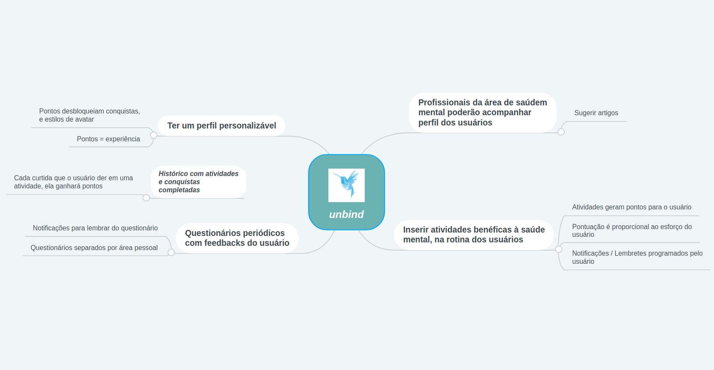

# Mapa Mental
### Histórico de revisão
Data | Versão | Descrição | Autor |
--------- | ------ | ------------ | --------- |
12/04/2019 | 0.1 | Versão 0.1 do mapa mental | Igor Aragão |
15/04/2019 | 0.2 | Versão 0.2 do mapa mental | Igor Aragão |
22/05/2019 | 0.2.1 | Elaboração do documento | Igor Aragão |

## 1. Introdução
Este documento tem como finalidade apresentar o mapa mental do projeto UNBIND.

## 2. Mapa mental
Mapa mental é um diagrama que permite que você organize ideias de forma simples e lógica, representando-as visualmente, facilitando o processo de memorização.

Portanto, para que o grupo alinhasse ideias, e refinasse o escopo, foi elaborado um mapa mental, com os principais focos da aplicação, e como elas poderiam interagir entre si:

## 3. Referências
* Como fazer um mapa mental. Disponível em: <https://geekiegames.geekie.com.br/blog/como-fazer-um-mapa-mental/>. Acesso em: 21 mai. 2019.
