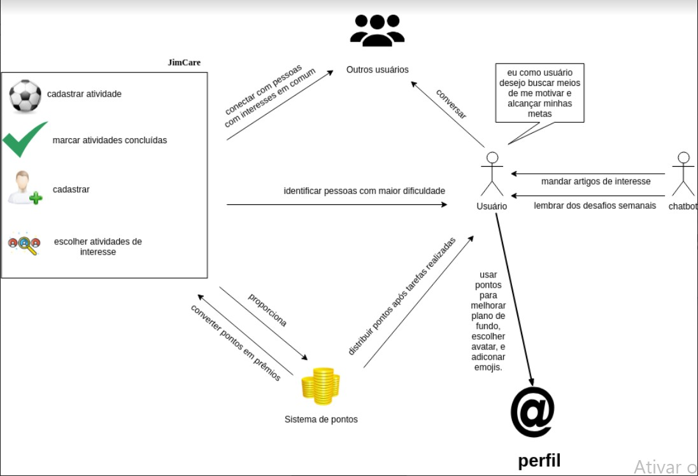
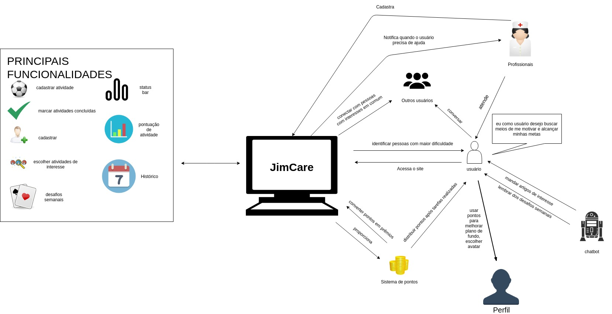

# Rich Picture
### Histórico de revisão
Data | Versão | Descrição | Autor |
--------- | ------ | ------------ | --------- |
28/03/2019 | 0.1 | Criação do Documento | Byron Kamal e Igor Veludo |
28/03/2019 | 0.2 | Rich Picture v0.1 | Byron Kamal e Igor Veludo |
29/03/2019 | 0.2 | Rich Picture v0.2 | William Almeida |
31/03/2019 | 1.0 | Rich Picture v1.0 | Byron Kamal, Igor Veludo, João Pedro Mota e William Almeida |
22/05/2019 | 0.4.1 | Refatoração do documento | Igor Aragão |

## 1. Introdução
O Rich Picture é um artefato usado para entender de forma visual, o fluxo e a complexidade de uma situação. Geralmente usado na fase de pré-rastreabilidade para analisar problemas e expressar ideias.

## 2. Rich Picture
A finalidade do uso do Rich Picture é fornecer um modelo que auxilia o entendimento e definição de uma situação ou escopo para trazer uma visão mais ampla do cenário que será analisado para o levantamento de requisitos.
### 2.1 Aplicação
#### 2.1.1 Versão 0.1

Autores: Byron Kamal e Igor Veludo
#### 2.1.2 Versão 0.2

Autores: William Almeida
#### 2.1.3 Versão 1.0

Autores: Byron Kamal, Igor Veludo, João Pedro Mota e William Almeida

