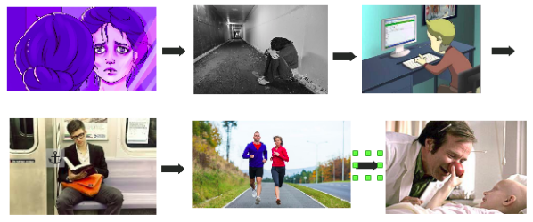

# Storytelling
### Histórico de revisão
Data | Versão | Descrição | Autor |
--------- | ------ | ------------ | --------- |
30/03/2019 | 0.1 | Primeira versão do documento | Geovanne Saraiva |
30/03/2019 | 0.1 | Adicionando versão 0.2 do storytelling | Geovanne Saraiva |
30/03/2019 | 0.1 | Refatoração do documento | Igor Aragão |

## 1. Introdução
Este documento tem como finalidade apresentar o storytelling, relacionado ao projeto UNBIND.

## 2. Storytelling
O storytelling é um artefato que reproduz uma história, na qual, a aplicação proposta poderia ajudar um usuário em uma situação pensada pelo autor.

### 2.1 Versão 0.1

> Autor: Geovanne Saraiva

### 2.2 Versão 0.2

> Autor: Geovanne Saraiva
