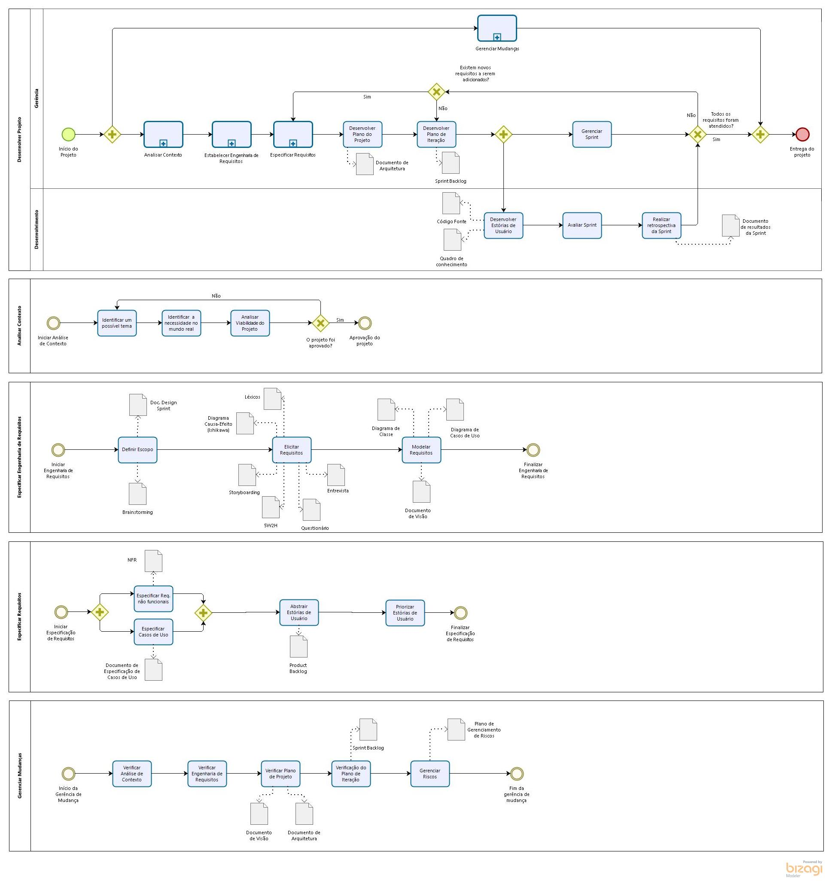
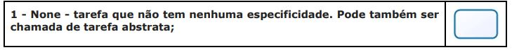

# Modelagem de Processos
### Histórico de revisão
Data | Versão | Descrição | Autor |
--------- | :------: | ------------ | --------- |
04/04/2019 | 0.1 | Abertura do documento | Byron Kamal e Ramon Sales |

## 1. Introdução
Este documento tem a finalidade de apresentar os processos e subprocessos de gerência e desenvolvimento, e da rastreabilidade de produção individual e da documentação a serem utilizados na disciplina de Arquitetura e Desenho de Software, no projeto UNBIND.

## 2. Modelagem de Processos

### 2.1 Processo de Gerência e Desenvolvimento
Modelagem de processos utilizada neste documento foi BPMN (Business Process Model and Notation). Ela é uma notação para modelagem de processos de negócio. O BPMN estabelece um padrão para representar os processos graficamente, por meio de diagramas. sendo que esse padrão possui um conjunto de símbolos e regras.
A ferramenta utilizada para fazer a representar gráfica do modelo de processo foi o Bizagi Modeler.

#### 2.1.1 Modelo

> Autores: Byron Kamal e Ramon Sales

#### 2.1.2 Legenda
##### Setas:

##### Tarefa:
Atividade que deve ser realizada.

##### Subprocesso:
Atividade que tem em seu interior a modelagem de outros atividades, eventos ou fluxos de sequência.

##### Evento:
é algo que “acontece” durante o curso do processo afetando o fluxo do processo.

##### Evento Final:
Indica o final de um processo.

##### Exclusivo:

##### Paralelo:

### 2.2 Processo de Rastreabilidade
A modelagem de processos utilizada neste documento foi, também, o BPMN. A ferramenta utilizada para fazer a representar gráfica do modelo de processo foi o draw.io.

#### 2.2.1 Modelo

> Autores: Geovanne Santos e Igor Aragão

### 3. Referências
* O que é BPMN (Business Process Model and Notation) e como aplicar essa notação na Modelagem de Processos. Disponível em: <https://www.euax.com.br/2017/02/o-que-e-bpmn-business-process-model-and-notation/>. Acessado em: 04/04/2019
* MANUAL DE MODELAGEM DE PROCESSOS COM BIZAGI MODELER. Disponível em: <http://www.sgc.goias.gov.br/upload/arquivos/2017-04/manual-de-modelagem-de-processos-usando-bizagi.pdf>. Acessado em: 02/04/2019.
