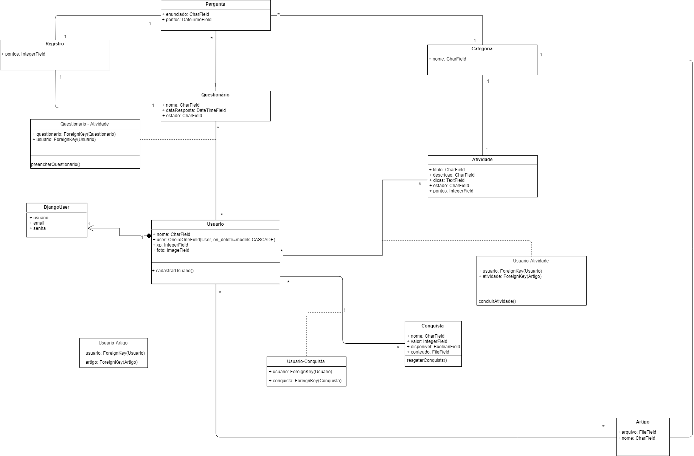

# Diagrama de Classes
### Histórico de revisão
Data | Versão | Descrição | Autor |
--------- | :------: | ------------ | --------- |
14/04/2019 | 0.1 | Criação do Diagrama de Classes | Byron Kamal, João Pedro Mota e José Aquiles |
23/04/2019 | 0.2 | Versão 0.2 do Diagrama de Classes | José Aquiles
31/05/2019 | 0.3 | Versão 0.3 do Diagrama de Classes | William Almeida, Igor Aragão e Igor Veludo |
30/06/2019 | 0.4 | Versão 0.4 do Diagrama de Classes | William Almeida |
## 1. Introdução
Este documento tem a finalidade de apresentar o Diagrama de Classes referente ao projeto UNBIND.

## 2. Diagrama de Classes
### 2.1 Versão 0.2

### 2.2 Versão 0.3

### 2.3 Versão 0.4

