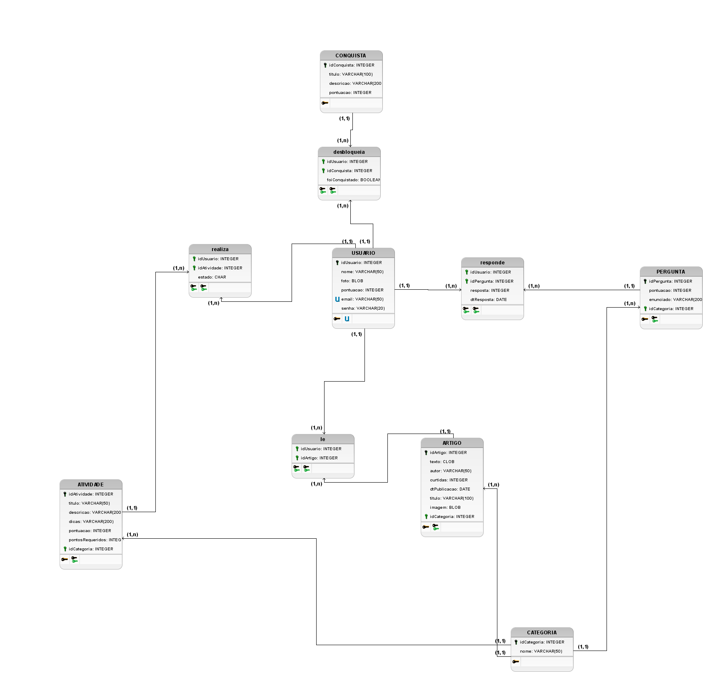

# Modelagem do Sistema

### Histórico de revisão

| Data       | Versão | Descrição                                    | Autor                                                                            |
| ---------- | :----: | -------------------------------------------- | -------------------------------------------------------------------------------- |
| 11/05/2019 |  0.1   | Abertura do documento                        | Geovanne Saraiva, Igor Aragão e William Almeida                                  |
| 12/05/2019 |  0.2   | Correção do ME-R e adição do DE-R            | Geovanne Saraiva e Vinícius Cantuária                                            |
| 12/05/2019 |  0.3   | Correção do DE-R e adição do Diagrama Lógico | Geovanne Saraiva, Igor Aragão, Vinícius Cantuária e William Almeida              |
| 18/05/2019 |  0.4   | Correção da Modelagem (ME-R, DE-R e DL)      | Igor Aragão, Igor Veludo e João Pedro Mota                                       |
| 01/06/2019 |  0.5   | Refatoração do documento                     | William Almeida                                                                  |
| 30/06/2019 |  0.6   | Corrige DE-R para versão 1.0                 | Vinícius Cantuária, Igor Aragão, Igor Veludo, Geovanne Saraiva e William Almeida |
| 30/06/2019 |  0.7   | Corrige DL para versão 1.0                   | Vinícius Cantuária, Igor Aragão, Igor Veludo, Geovanne Saraiva e William Almeida |
| 30/06/2019 |  1.0   | Corrige ME-R para versão 1.0                 | Vinícius Cantuária, Igor Aragão, Igor Veludo, Geovanne Saraiva e William Almeida |

## 1. Introdução

Este documento tem a finalidade de apresentar a modelagem do sistema, no contexto do projeto UNBIND. Utilizamos ferramentas padrões da modelagem de bancos de dados.

## 2. Modelagem do Sistema

### 2.1 Modelo Entidade-Relacionamento (ME-R)

#### 2.1.1 Entidades:

- ARTIGO
- ATIVIDADE
- CATEGORIA
- CONQUISTA
- QUESTIONARIO
- PERGUNTA
- REGISTRO
- USUARIO

#### 2.1.2 Atributos:

- ARTIGO (idArtigo, titulo, texto, imagem, autor, curtidas, dataPublicacao, idCategoria)
- ATIVIDADE (idAtividade, titulo, descricao, dicas, estado, pontos, idCategoria)
- CATEGORIA (idCategoria, nome)
- CONQUISTA (idConquista, nomeConquista, valor, disponivel, conteudo)
- QUESTIONARIO (idQuestionario, nome, dataResposta, estado)
- PERGUNTA (idPergunta, enunciado, idCategoria, idQuestionario)
- REGISTRO (idRegistro, pontos, idUsuario, idPergunta)
- USUARIO (idUsuario, nome, foto, scoreTotal, email, senha, idAtividade, idArtigo, idConquista, idQuestionario, idPergunta)

#### 2.1.3 Relacionamento

- ARTIGO - tem - CATEGORIA

  - Um ARTIGO tem uma CATEGORIA, mas uma CATEGORIA pode ser de vários ARTIGO.
  - Cardinalidade: n:1

- ATIVIDADE - possui - CATEGORIA

  - Uma ATIVIDADE possui uma CATEGORIA, mas uma CATEGORIA pode ser possuída por várias CATEGORIAS.
  - Cardinalidade: n:1

- CATEGORIA - possui - PERGUNTA

  - Uma CATEGORIA pode possui várias PERGUNTA, mas uma PERGUNTA só pode ser possuída por uma CATEGORIA.
  - Cardinalidade: 1:n

- QUESTIONARIO - possui - PERGUNTA

  - Um QUESTIONARIO pode possui várias PERGUNTAS, mas uma PERGUNTA só pode ser possuída por um QUESTIONARIO.
  - Cardinalidade: 1:n

- PERGUNTA - possui - REGISTRO

  - Uma PERGUNTA pode possuir vários REGISTRO, mas um REGISTRO só pode ser possuído por uma PERGUNTA.
  - Cardinalidade: 1:n

- USUARIO - desbloqueia - CONQUISTA

  - Um USUARIO pode desbloquear várias CONQUISTA e uma CONQUISTA pode ser desbloqueada por vários USUARIO.
  - Cardinalidade: n:m

- USUARIO - realiza - ATIVIDADE

  - Um USUARIO pode executar várias ATIVIDADE e uma ATIVIDADE pode ser executada por vários USUARIO.
  - Cardinalidade: n:m

- USUARIO - le - ARTIGO

  - Um USUARIO pode ler vários ARTIGO e um ARTIGO pode ser lido por vários USUARIO.
  - Cardinalidade: n:m

- USUARIO - faz - REGISTRO

  - Um USUARIO pode fazer vários REGISTRO, mas um REGISTRO só pode ser feito por um USUARIO.
  - Cardinalidade: 1:n

- USUARIO - responde - PERGUNTA

  - Um USUARIO pode responder várias PERGUNTA e uma PERGUNTA pode ser respondido por vários USUARIO.
  - Cardinalidade: n:m

- USUARIO - realiza - QUESTIONARIO
  - Um USUARIO pode realizar vários QUESTIONARIO e um QUESTIONARIO pode ser realizado por vários USUARIO.
  - Cardinalidade: n:m

### 2.2 Diagrama Entidade-Relacionamento (DE-R)

#### 2.2.1 Versão 0.1

#### 2.2.2 Versão 0.2

#### 2.2.3 Versão 0.3

#### 2.2.4 Versão 1.0

### 2.3 Diagrama Lógico (DL)

#### 2.3.1 Versão 0.1

#### 2.3.2 Versão 0.2

#### 2.3.3 Versão 1

