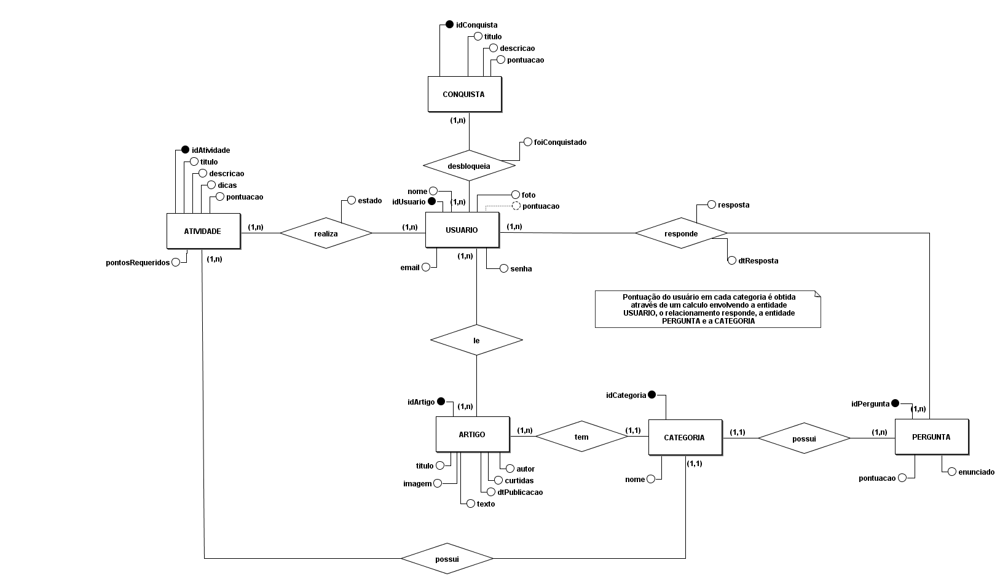

# Modelagem do Sistema
### Histórico de revisão
Data | Versão | Descrição | Autor |
--------- | :------: | ------------ | --------- |
11/05/2019 | 0.1 | Abertura do documento | Geovanne Saraiva, Igor Aragão e William Almeida |
12/05/2019 | 0.2 | Correção do ME-R e adição do DE-R | Geovanne Saraiva e Vinícius Cantuária |
12/05/2019 | 0.3 | Correção do DE-R e adição do Diagrama Lógico | Geovanne Saraiva, Igor Aragão, Vinícius Cantuária e William Almeida |
18/05/2019 | 0.4 | Correção da Modelagem (ME-R, DE-R e DL) | Igor Aragão, Igor Veludo e João Pedro Mota |
01/06/2019 | 0.5 | Refatoração do documento | William Almeida |

## 1. Introdução

Este documento tem a finalidade de apresentar a modelagem do sistema, no contexto do projeto UNBIND. Utilizamos ferramentas padrões da modelagem de bancos de dados.

## 2. Modelagem do Sistema
### 2.1 Modelo Entidade-Relacionamento (ME-R)
#### 2.1.1 Entidades:
* USUARIO
* CONQUISTA
* CATEGORIA
* PERGUNTA
* ARTIGO
* ATIVIDADE

#### 2.1.2 Atributos:
* USUARIO (idUsuario, nome, email, senha, foto)
* CONQUISTA (idConquista, titulo, descricao, pontuacao)
* CATEGORIA (idCategoria, nome)
* PERGUNTA (idPergunta, enunciado, score)
* ARTIGO (idArtigo, titulo, texto, imagem, autor, curtidas, dtPublicacao)
* ATIVIDADE (idAtividade, titulo, descricao, dicas, pontuacao, pontosRequeridos)

#### 2.1.3 Relacionamento
* USUARIO - responde - PERGUNTA  
Um USUARIO pode responder uma ou mais PERGUNTAS, e uma PERGUNTA pode ser respondido por um ou mais USUARIOS.  
Cardinalidade: n:m

* USUARIO - realiza - ATIVIDADE  
Um USUARIO pode executar uma ou até 3 ATIVIDADE ao mesmo tempo, e uma ATIVIDADE pode ser executada por um ou mais USUARIO.  
Cardinalidade: n:m

* USUARIO - desbloqueia - CONQUISTA  
Um USUARIO pode desbloquear uma ou mais CONQUISTA, e uma CONQUISTA pode ser desbloqueada por um ou mais USUARIO.  
Cardinalidade: n:m

* USUARIO - lê - ARTIGO  
Um USUARIO pode ler um ou mais ARTIGO, e um ARTIGO pode ser lido por um ou mais USUARIO.  
Cardinalidade: n:m

* CATEGORIA - possui - PERGUNTA  
Uma CATEGORIA possui várias PERGUNTAs, mas uma PERGUNTA só pode ser de uma CATEGORIA.  
Cardinalidade: 1:n

* CATEGORIA - possui - ATIVIDADE  
Uma CATEGORIA possui várias ATIVIDADEs, mas uma ATIVIDADE só pode ser de uma CATEGORIA.  
Cardinalidade: 1:n

* CATEGORIA - possui - ARTIGO  
Uma CATEGORIA possui vários ARTIGOs, mas um ARTIGO só pode ser de uma CATEGORIA.  
Cardinalidade: 1:n

### 2.2 Diagrama Entidade-Relacionamento (DE-R)
#### 2.2.1 Versão 0.1

#### 2.2.2 Versão 0.2

#### 2.2.3 Versão 0.3

### 2.3 Diagrama Lógico (DL)
#### 2.3.1 Versão 0.1

#### 2.3.2 Versão 0.2

