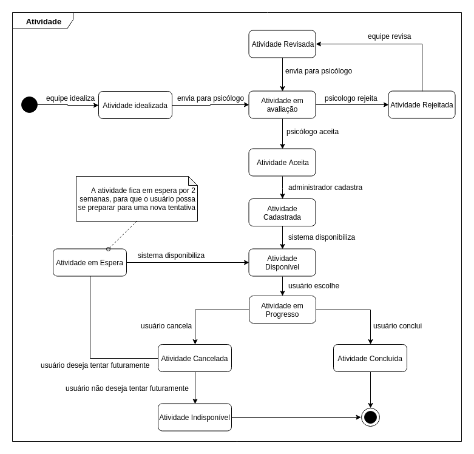

# Diagrama de Estados
### Histórico de revisão
Data | Versão | Descrição | Autor |
--------- | :------: | ------------ | --------- |
29/04/2019 | 0.1 | Criação dos Diagramas de Estados | Igor Aragão e William Almeida |

## 1. Introdução
Este documento tem a finalidade de apresentar os diagramas de estados referentes ao projeto UNBIND. 

## 2. Diagramas de Estados
### 2.1 Artigos
#### 2.1.1 Versão 0.1

### 2.2 Atividades
#### 2.2.1 Versão 0.1

