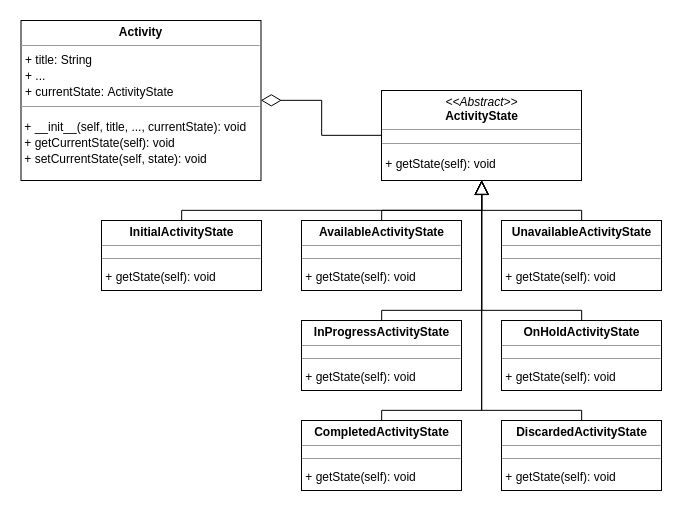

# GOFs

### Histórico de revisão

| Data       | Versão | Descrição                                                | Autor                                                                                  |
| ---------- | ------ | -------------------------------------------------------- | -------------------------------------------------------------------------------------- |
| 26/05/2019 | 0.1    | Adição dos GOFs Facade, Factory method e Template method | Byron Kamal, Igor Aragão, Igor Veludo, João Pedro Mota, José Aquiles e William Almeida |
| 26/05/2019 | 0.2    | Adição do GOF State                                      | Igor Aragão                                                                            |

## Introdução

Padrões de projeto são descrições ou modelos de como resolver um problema que podem ser usados em diversas situações.

Os padrões GOF (<i>Gang of Four</i>) são soluções reutilizáveis de software orientado a objetos que são divididos em três categorias: de Criação, Estrutural e Comportamental.

Este documento detalha os padrões GOF utilizados no projeto UnBind.

## Factory

É um padrão GOF criacional que define uma interface para criar um objeto, mas deixa que as subclasses decidam quais classes instanciar.

### Estrutura genérica

### Utilização no projeto UNBIND

O projeto é desenvolvido utilizando o <i>Framework</i> Django da linguagem Python, e o mesmo possui um módulo de Forms no qual é responsável por definir os campos necessários para que seja construído um objeto

#### Implementação

O modulo <i>Forms</i> de Usuário é responsável por definir os campos de entrada de dado de um usuário, ou seja os atributo necessários para a instanciação de um determinado objeto

A classe meta define qual a model que sera utilizada na construção do formulário, e os fields definem os campos necessários para a construção de um objeto deste tipo.

> Utilização deste método pode ser visto no nosso repositório no GitHub, clicando [aqui](https://github.com/ads-unbind/unbind/commit/51841afbd71f0b0f10b134d73b99cba435334f6f).

## Facade

Prover uma interface simplificada para a utilização de várias interfaces de um subsistema.

### Estrutura genérica

### Utilização no projeto UNBIND

Essa estrutura já é implementada no django com o arquivo urls.py, onde é feito todo o gerenciamento de rotas da aplicação. No django existem vários apps, no qual cada um tem a sua própria url, e o arquivo urls.py nada mais é do que uma fachada que gerencia outras fachadas.

#### Implementação

> Utilização deste método pode ser visto no nosso repositório no GitHub, clicando [aqui](https://github.com/ads-unbind/unbind/commit/f327db5d6cb2c2a3648c88351718095dc3e9b20a).

## Template Method

Defina o esqueleto de um algoritmo em uma operação, adiando algumas etapas para as subclasses do cliente. Template Method permite que as subclasses redefinam certas etapas de um algoritmo sem alterar a estrutura do algoritmo.

### Estrutura Genérica

### Utilização no projeto UNBIND

Essa estrutura é utilizada nos forms dos apps da aplicação, onde se define os campos que estarão presentes em determinados formulários.

#### Implementação

> Utilização deste método pode ser visto no nosso repositório no GitHub, clicando [aqui](https://github.com/ads-unbind/unbind/commit/d7a1ec6bf0fa87e6443e44cfb9baac54dfd0c3df).

## State

É um padrão GOF comportamental que permite um objeto modificar seu comportamento quando necessário.

### Estrutura genérica

### Utilização no projeto UNBIND

Essa estrutura será utilizada para gerenciar a troca de estados da classe Atividade.

#### Implementação

A classe Atividade envolve 7 estados diferentes, sendo eles: Inicial, Disponível, Indisponível, Em Progresso, Em Espera, Finalizada e Descartada.

> A prévia da utilização deste método pode ser visto através [desse link](https://repl.it/@IgorAragao/StateActivityGOF).

## Referências

- [Observer Design Pattern](https://sourcemaking.com/design_patterns/observer)
- [Abstract Base Classes in Python](http://blog.thedigitalcatonline.com/blog/2016/04/03/abstract-base-classes-in-python/)
- [Strategy Design Pattern](https://sourcemaking.com/design_patterns/state)
- [Python Higher Order Functions](https://www.hackerearth.com/pt-br/practice/python/functional-programming/higher-order-functions-and-decorators/tutorial/)
- [Python Patterns](https://github.com/faif/python-patterns)
