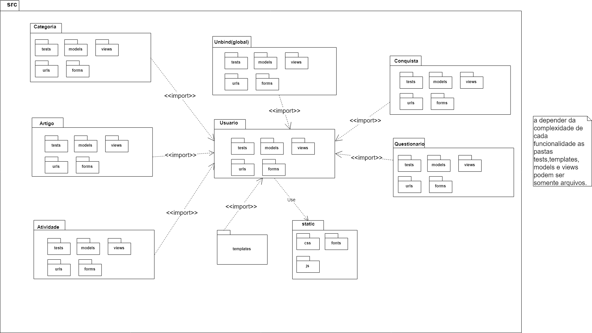
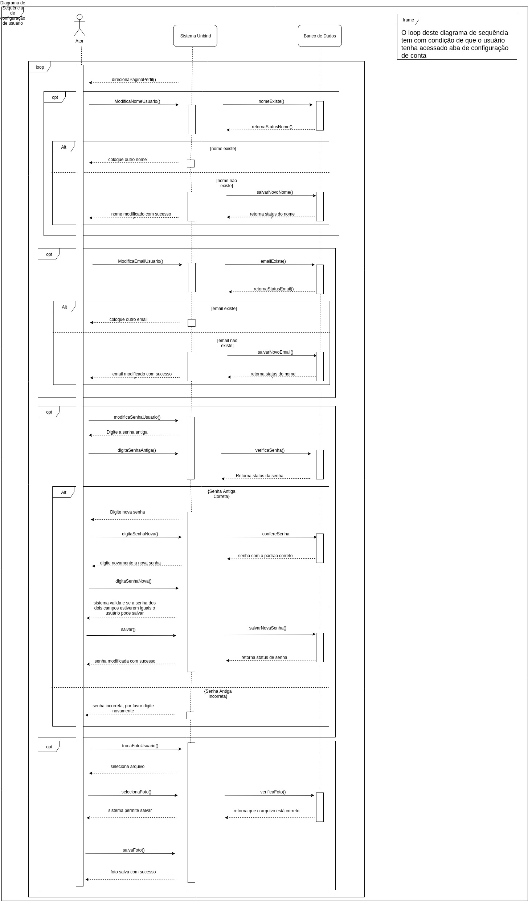
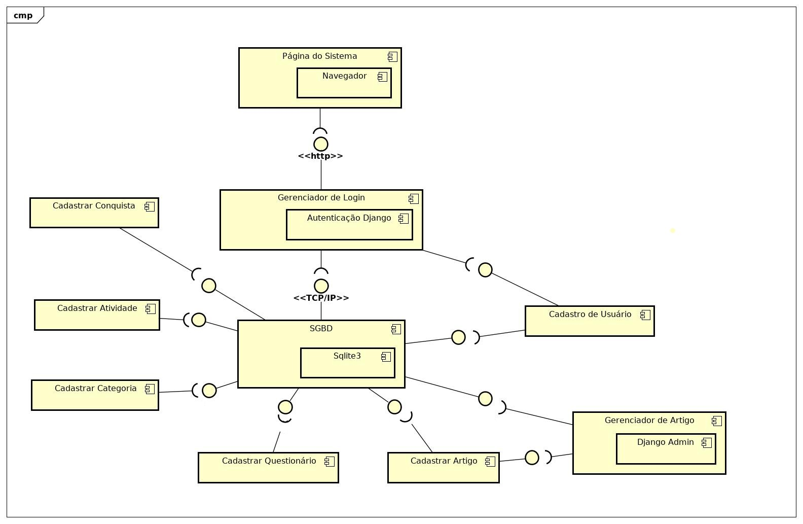
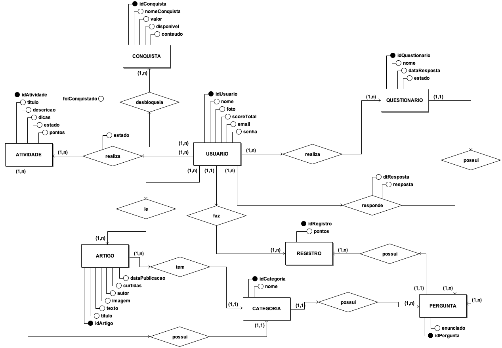
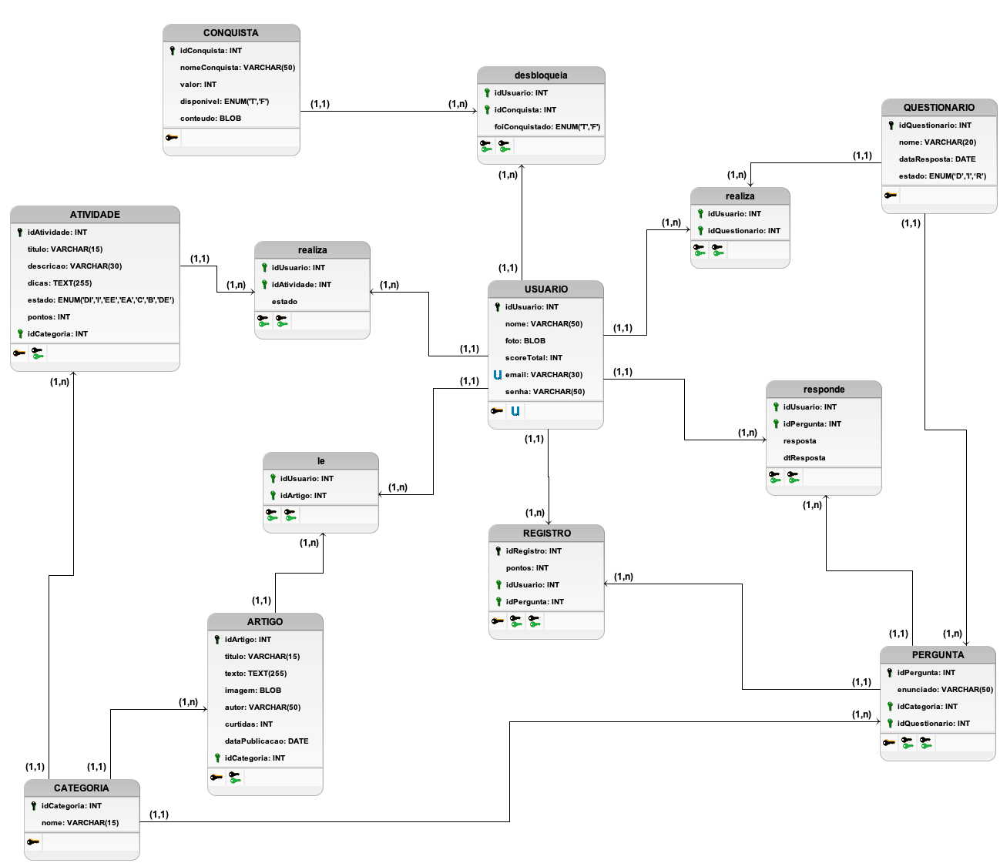

# Documento de Arquitetura

## Histórico de versão

| Data       | Versão | Descrição                                                           | Responsáveis                                                                                                                 |
| ---------- | ------ | ------------------------------------------------------------------- | ---------------------------------------------------------------------------------------------------------------------------- |
| 15/06/2019 | 0.1    | Criação do documento                                                | Byron Kamal, Geovanne Saraiva, Igor Aragão, Igor Veludo, João Pedro Mota, José Aquiles, Vinícius Cantuária e William Almeida |
| 16/06/2019 | 0.1.2  | Reestruturando documento                                            | Igor Aragão                                                                                                                  |
| 21/06/2019 | 0.2    | Adicionando versões 1.0 e 2.0 do diagrama de componentes - Tópico 7 | Byron Kamal e Igor Veludo                                                                                                    |
| 21/06/2019 | 0.3    | Modificando o tópico 2 e o 4 do documento                           | William Almeida                                                                                                              |
| 23/06/2019 | 0.4    | Adicionando tópico 3                                                | Byron Kamal, Igor Veludo e João Pedro Mota                                                                                   |
| 23/06/2019 | 0.5    | Adicionando a seção 5.2.1 e refatorando a seção 5.2.3               | William Almeida                                                                                                              |
| 24/06/2019 | 0.5.1  | Adicionando a seção 5.2.2                                           | Byron Kamal e Igor Veludo                                                                                                    |
| 24/06/2019 | 0.6    | Adicionando o diagrama de implantação na seção 7                    | Igor Aragão e William Almeida                                                                                                |
| 24/06/2019 | 0.7    | Adicionando DE-R e modelo lógico                                    | José Aquiles                                                                                                                 |
| 24/06/2019 | 0.8    | Adicionando tópico 9                                                | Geovanne Santos e Vinícius                                                                                                   |
| 30/06/2019 | 0.9    | Alterando diagrama de classes                                       | William Almeida, Geovanne, Vinícius e Igor Aragão                                                                            |
| 30/06/2019 | 0.10   | Corrige modelagem do sistema                                        | Vinícius Cantuária, Geovanne, Igor Aragão, Igor Veludo, e William Almeida                                                    |
| 30/06/2019 | 0.11   | Adiciona linkagem de modelagem do sistema com modelagem do sistema  | Vinícius Cantuária, Geovanne, Igor Aragão, Igor Veludo, e William Almeida                                                    |
| 30/06/2019 | 0.12   | Adiciona diagrama de atividade e de sequência                       | Vinícius Cantuária, Geovanne, Igor Aragão, Igor Veludo, e William Almeida                                                    |
| 30/06/2019 | 0.13   | Complementa Usabilidade                                             | Vinícius Cantuária, Geovanne, Igor Aragão, Igor Veludo, e William Almeida                                                    |
| 30/06/2019 | 0.14   | Adiciona navegabilidade                                            | Vinícius Cantuária, Geovanne, Igor Aragão, Igor Veludo, e William Almeida                                                    |

# Sumário
1. [Introdução](#1-introdução)
2. [Representação da arquitetura](##2-representação-da-arquitetura)
3. [Metas e Restrições de arquitetura](#3-metas-e-restrições-de-arquitetura)
4. [Visão de Casos de Uso](#4-visão-de-casos-de-uso)
5. [Visão Lógica](#5-visão-lógica)
6. [Visão de implantação](#6-visão-de-implantação)
7. [Diagrama de sequência](#7-diagrama-de-sequência)
8. [Diagrama de atividade](#8-diagrama-de-atividade)
9. [Visão de implementação](#9-visão-de-implementação)
10. [Visão de dados](#10-visão-de-dados)
11. [Qualidade](#11-qualidade)
12. [Requisitos mínimos dos sistemas](#12-requisitos-mínimos-dos-sistemas)
13. [Referências](#13-referências)

## 1\. Introdução

### 1.1 Finalidade

Este documento tem como finalidade apresentar a arquitetura do projeto **UNBIND** através de visões diversas para registrar as decisões arquiteturais relacionadas ao projeto. O documento é dividido da seguinte maneira: inicialmente é apresentada a representação da arquitetura da solução, em seguida as metas e restrições desta arquitetura e por fim são apresentadas visões sobre elementos da arquitetura.

### 1.2 Escopo

Este documento apresenta as características arquiteturais do projeto **UNBIND**, descrevendo em detalhes a soluções arquiteturais determinadas para o projeto, de forma a servir como base para o desenvolvimento do projeto pelos desenvolvedores de software alocados para o projeto.

## 1.3 Definições, Acrônimos, e Abreviações

**MVC** - Model View Controller

**MTV** - Model Template View

**UNBIND** - Aplicação web, desenvolvida em Django, que tem como objetivo ajudar pessoas com rotinas desgastantes, estimulando-as a realizar atividades que tragam felicidade.

**Django** - Framework da linguagem python para a construção rápida de aplicativos web, fornecendo componentes prontos e com fácil uso.

## 2\. Representação da Arquitetura

O sistema faz uso do Framework Django (versão 2.2.2), que faz uso do padrão MVC. No entanto, tal plataforma possui uma interpretação singular em relação à organização de camadas. O indicado é considerar que a própria plataforma faz o papel da camada de controle, enquanto a camada de Modelo e de Visão devem ser adaptadas e reinterpretadas conforme o necessário. Por este motivo, ainda que o Django implemente o MVC, considera-se que o padrão de camadas externalizado pela plataforma é o MTV (Model-Template-View).

A utilização de uma arquitetura em camadas é interessante por proporcionar uma clara separação de responsabilidades no código, proporcionando reusabilidade, e reduzindo o esforço de manutenção. Os conceitos de MVC e MTV serão apresentados nas seções seguintes.

### 2.1 Model View Controller (MVC)

Figura 1\. Padrão arquitetural MVC.

- **Model**: camada de acesso a base de dados, é responsável pela leitura, manipulação e validação dados;

- **Controller**: é responsável por manipular e validar as requisições do usuário, traduzindo em comandos enviados para enviados para a Model e/ou View .

- **View**: camada de interface com o usuário, responsável pela representação dos dados;

### 2.2 Model Template View (MTV)

Figura 2\. Padrão arquitetural MTV.

- **Model**: segue a mesma definição da model no MVC;

- **Template**: segue a mesma definição da view no MVC;

- **View**: segue a mesma definição da controller no MVC.

## 3\. Metas e Restrições de Arquitetura

| Restrição     | Descrição                                                                                                                                                                                                                                                                                                                                                          |
| ------------- | ------------------------------------------------------------------------------------------------------------------------------------------------------------------------------------------------------------------------------------------------------------------------------------------------------------------------------------------------------------------ |
| Linguagem     | O sistema será inteiramente desenvolvido utilizando a linguagem Python.                                                                                                                                                                                                                                                                                            |
| Plataforma    | Será utilizado o framework Django tanto para o front quanto para o back-end.                                                                                                                                                                                                                                                                                       |
| Segurança     | Para a segurança do usuário, todas as senhas de login são criptografadas.                                                                                                                                                                                                                                                                                          |
| Persistência  | Para a persistência dos dados será utilizado o banco de dados relacional SQLite3.                                                                                                                                                                                                                                                                                  |
| Arquitetura   | Será feita uma arquitetura monolítica, nela o deploy torna-se mais fácil, já que é necessário subir somente um projeto e o banco de dados facilmente evolui junto para todas as funcionalidades juntamente com a aplicação. Também não há duplicidade de código e classes necessárias entre os diferentes módulos, já que todas elas fazem parte da mesma unidade. |
| Portabilidade | Por se tratar de uma aplicação web, possui grande portabilidade entre sistemas, sendo acessada através do navegador, porém não possui portabilidade para mobile.                                                                                                                                                                                                   |
| Distribuição  | Por se tratar de uma aplicação web, a distribuição ocorre assim que a nova versão do software é enviada para produção. O usuário sempre acesa a última versão disponível.                                                                                                                                                                                          |
| Reuso         | A utilização do framework Django demonstra um grau de reuso devido a padronização da criação de componentes do código.                                                                                                                                                                                                                                             |

## 4\. Visão de Casos de Uso

Segue abaixo a lista com os principais casos de uso do projeto UNBIND:

- Responder questionário
- Visualizar artigos personalizados
- Gerar avaliação de desempenho
- Visualizar tarefa específica
- Pontuar usuário

Figura 3\. Diagrama de Casos de Uso.

## 5\. Visão Lógica

Foram feitos modelos seguindo o padrão UML relacionados aos aspectos arquiteturais do sistema, como as classes e pacotes utilizados no projeto.

### 5.1 Diagramas Significativos

#### 5.1.1 Diagrama de Classes

O diagrama de classes tem como principal propósito relacionar os tipos modelados no sistema. Geralmente, inclui classe, interface, tipo de dado, restrição de acesso e dependências. Dessa forma, consiste em um importante artefato da UML (Unified Modeling Language) para documentação das classes codificadas ou que serão codificadas em uma aplicação.

As principais classes da aplicação são:

- Usuário: herda da classe User adicionando atributos.
- Atividade: responsável pelas atividades realizadas pelos usuários, que geram pontos.
- Artigo: responsável pelos artigos que serão apresentados aos usuários.
- Conquista: responsável pelas conquistas adquiridas pelos usuários, relacionadas aos pontos.
- Categoria: responsável pela categorização das atividades, artigos e perguntas.
- Questionário: é composta de objetos da classe Pergunta e é utilizada para fazer a avaliação dos usuários.
- Pergunta: utilizada para definir a pontuação do usuário em cada categoria.

#### 5.1.2 Diagrama de Colaboração

O diagrama de colaboração permite a identificação de aspectos importantes na cooperação entre uma série de instâncias, identificando as funções que serão executadas pelas instâncias.

#### 5.1.3 Diagrama de Pacotes

O Diagrama de pacotes, ou diagrama de módulos, definido pela UML, descreve os pacotes ou pedaços do sistema divididos em agrupamentos lógicos mostrando as dependências entre eles. Este diagrama é muito utilizado para ilustrar a arquitetura de um sistema mostrando o agrupamento de suas classes. O Django organiza seus componentes em apps que possuem arquivos referentes a cada aplicação.

##### Apps: cada app possui arquivos de models, views, tests, forms e urls.

- models: arquivos com as models.
- views: arquivos com as views.
- tests: arquivos com testes unitários.
- forms: arquivos contendo os formulários.
- urls: arquivo responsável pelo roteamento.

##### Static: pasta para os arquivos estáticos do projeto em geral.

- css: pasta com os arquivos CSS.
- fonts: pasta com os arquivos de fontes de textos.
- js: pasta com os arquivos JS.
- profile_image: pasta com as imagens de perfil dos usuários.

##### Templates: pasta com todos arquivos de template do projeto (HTML).

##### Docs: pasta com todos arquivos referentes à documentação do projeto.

##### Src: pasta com todos arquivos referentes ao desenvolvimento da aplicação.

### 6\. Visão de Implantação

#### 6.1 Diagrama de Implantação

### 7\. Diagrama de Sequência

#### 7.1 Diagrama de Sequência Geral

#### 7.2 Diagrama de Sequência de usuário

### 8\. Diagrama de Atividade

#### 8.1 Diagrama de Atividades (Atividade)

#### 8.2 Diagrama de Atividades (Artigo)

### 9\. Visão de Implementação

#### 9.1 Finalidade

Proporcionam um método alternativo para implementar views como objetos ao invés de funções. As Class-Based Views (CBV) são classes que implementam métodos e atributos que são comumente utilizados na programação das views. Dessa maneira, o programador pode utilizar métodos já implementados ou sobrescrevê-los e implementá-los da sua maneira. Para atender os mais variados casos de uso das views, as CBV oferecem diversos temas para implementação.

Podemos então agregar as funções básicas das views dentro de classes, como métodos. Os recursos das Class Based Views estão em algumas classes "pré-prontas", as quais outras classes podem herdar. A partir daí as alterações que precisam ser feitas são mínimas.

### 9.2 Diagramas Significativos

#### 9.2.1 Diagrama de Componentes

### 10\. [Visão de Dados](../dinamica3/modelagem-sistema.md)

#### 10.1 [Diagrama Entidade-Relacionamento](../dinamica3/modelagem-sistema.md#22-diagrama-entidade-relacionamento-de-r)

#### 10.2 [Diagrama Lógico](../dinamica3/modelagem-sistema.md#23-diagrama-logico-dl)

##### 10.2.1 Diagrama Lógico Modelado

##### 10.2.2 Diagrama Lógico Gerado pelo Django

## 11\. Qualidade

Os seguintes itens conferem ao sistema aspectos de qualidade, bem como a descrição da abordagem realizada para satisfazer esses aspectos. São estes aspectos, legais e reguladores, como as normas estabelecidas para bom funcionamento do sistema, atributos de qualidade, como padrões de usabilidade, confiabilidade, desempenho e suportabilidade.

### 11.1 Requisitos funcionais

Os requisitos funcionais, e suas prioridades, podem ser encontrados [aqui](https://github.com/ads-unbind/unbind/blob/master/wiki/docs/dinamica1/moscow.md)

### 11.2 Requisitos não funcionais

| Identificador | Descrição                                               |
| ------------- | ------------------------------------------------------- |
| RNF 01        | Sistema de autenticação de usuário (Segurança)          |
| RNF 02        | Serviço de busca (Base de Dados)                        |
| RNF 03        | Interface simples e interativa ao usuário (Usabilidade) |

### 11.3 Requisitos para plataformas específicas

| Identificador | Navegador Web     | Modelo               | Versão                                        |
| ------------- | ----------------- | -------------------- | --------------------------------------------- |
| RNF 01        | Internet Explorer | Qualquer dispositivo | Versão 10 ou superior.                        |
| RNF 02        | Google Chrome     | Qualquer dispositivo | Última versão                                 |
| RNF 03        | Mozilla Firefox   | Qualquer dispositivo | versão mais recente ou imediatamente anterior |
| RNF 04        | Opera             | Qualquer dispositivo | 12 ou superior.                               |
| RNF 05        | Safari            | Qualquer dispositivo | Versão 6 ou superior.                         |

### 11.4 Usabilidade

Será usado técnicas aprendidas na matéria Interação Humano Computador, ministrado na Universidade de Brasília, Faculdade UnB Gama.

- Facilidade de uso: Os recursos e funcionalidades do serviço devem apresentar-se de forma intuitiva para que o usuário possa facilmente navegar por eles, não sendo necessário a realização de qualquer tipo de treinamento prévio por parte do usuário.

- Mensagem de erro: O serviço deve apresentar mensagens de erro de forma clara e objetiva, localizadas próximas ao conteúdo ou ação que motivou o erro.

- Eficiência: O sistema deve fornecer rápido acesso a qualquer funcionalidade.

- Consistência e Padronização: O sistema deve manter a maior parte da interface a mesma para cada tipo de usuário, apenas adicionando alguns detalhes sobre a mesma de acordo com o nível de cada tipo de usuário.

- Design Simples: O sistema deve ter ícones intuitivos. Para cada tipo de usuário haverá um certo nível de funcionalidades disponíveis.

### 11.5 Confiabilidade

- Disponibilidade: O sistema estará disponível no modo 24/7 (24 horas por dia, 7 dias por semana). O servidor será terceirizado para ter uma capacidade operacional confiável.

- Suportabilidade: O sistema deverá suportar 100.000 usuários ativos simultaneamente. O servidor será terceirizado para aguentar uma grande demanda.

- Direitos autorais: O sistema deverá garantir que os direitos autorais dos autores dos artigos sejam preservados. Oferecerá um suporte para que todos os usuários possam realizar denúncias ao se deparar com conteúdos que violem direitos de propriedade intelectual ou conteúdos que sejam ofensivos.

- Segurança e Privacidade: O sistema deve assegurar a segurança e privacidade dos dados gerados, armazenando senhas e dados sensíveis de forma segura. O sistema deve ser transparente quanto às informações coletadas referentes a dados pessoais do usuário e preferências de conteúdo e fornecer ao usuário a possibilidade de ajustar a visibilidade de tais informações.

### 11.6 Desempenho

- Tempo de Resposta: O aplicativo tem de responder às ações do usuário de imediato.

- Volume de assinantes: O sistema será capaz de suportar 100.000 de usuários ativos simultaneamente.

- Modo de degradação: Se o sistema estiver sofrendo com algo que degrade o site, como a internet com sinal fraco, terá páginas que não serão carregadas.

- Utilização de Recursos: OS X 10.9 ou superior, Windows 7 ou superior, Versão 6 ou superior.

### 11.7 Suportabilidade

- Software do usuário: O usuário será capaz de utilizar o sistema através de um navegador de internet. Não será necessário que nenhum software personalizado resida no computador pessoal. Estes são os requisitos de sistema para usar o UNBIND e acessar seu conteúdo por meio do site.

### 11.8 Restrições de Design

- Restrição de Design Um: O sistema deverá ser disponibilizado em diversas línguas, quando o usuário mudar o idioma nas opções de configuração o site se modificará.

- Restrição de Design Cinco: Antes do usuário poder ver as funcionalidades do site, terá que ter uma tela inicial com a opção de login e cadastro.

- Restrição de Design Sete: O nome da página sempre estará no topo do layout.

### 11.9 Requisitos de Sistema de Ajuda e de Documentação de Usuário On-line

- Área de busca para encontrar soluções para as questões mais frequentes

- Tutoriais claros e objetivos de como o usuário pode utilizar os recursos do serviço

### 11.10 Interfaces de Hardware

O software oferece suporte aos dispositivos apresentados abaixo.

- Smartphones.

- Computadores Notebooks.

- Computadores Desktop.

## 12\. Requisitos Mínimos dos Sistemas

### 12.1 Sistema executar o projeto UnBind

- Processador: Intel Atom ou Intel Core i3 (ou similar)
- Espaço em disco: 1GB
- Sistema Operacional: Windows 7 ou superior, macOS e Linux
- Python versões: 2.7.x ou superior
- Django: 2.2.2 (padrão)

### 12.2 Servidor de Banco de Dados e Servidor Web

Os requisitos apresentados a seguir foram estudados para o sistema suportar cerca de 10 mil
de usuários, caso o sistema tenha que operar com mais usuários será necessário um estudo mais aprofundado.

#### 12.2.1 Servidor de Banco de Dados

- Processador: Xeon E5 server family
- CPU: 2 x 4 cores
- CPU (expansabilidade futura): entre 1 a 4 sockets
- Memória RAM: mínimo 16GB
- Espeço de Disco: entre 16GB e 1.5TB
- Backup: HDD ou Fita Máguinetica

##### 12.2.1.1 SQLite

Para servidores Linux, as seguintes configurações podem ser aplicadas para rodar o banco de dados SQLite:

- Java Runtime Environment (JRE) 1.5 ou superior
- Memória RAM: 500MB

#### 12.2.1 Servidor Web

- Processador: Intel i7 - 3770 (similar ou superior)
- Memoria RAM: 32GB
- CPU: 4 núcleos ou mais
- HDD: 146GB com cache 128MB

## 13\. Referências

- Arquitetura de microserviços ou monolítica?, Caelum. Disponível em: <<https://blog.caelum.com.br/arquitetura-de-microservicos-ou-monolitica/>>.

- UML 2.5 Diagrams Overview. Disponível em: <<https://www.uml-diagrams.org/uml-25-diagrams.html>>.

- Software Architecture: MVC Design Pattern, Medium. Disponível em: [//medium.com/@dennisvera.z/software-architecture-mvc-design-pattern-ceae5d5083d7)](mailto://medium.com/@dennisvera.z/software-architecture-mvc-design-pattern-ceae5d5083d7)).

- Django's Structure – A Heretic's Eye View, The django book. Disponível em: <<https://djangobook.com/mdj2-django-structure/>>.

- Working Structure of Django MTV Architecture, Towards Data Science. Disponível em: <<https://towardsdatascience.com/working-structure-of-django-mtv-architecture-a741c8c64082>>.

- Django documentation. Disponível em: <<https://docs.djangoproject.com/en/2.2/>>.

- Diretriz: Realizações de Casos de Uso. Disponível em: <<http://www.hectordufau.com.br/openup/openup/guidances/guidelines/uc_realizations_448DDA77.html>>.

- Requisitos de Sistemas. Disponível em: <<http://www.stansoftware.com/hardware-requirements/>>

- Intel Distribution for Python. Disponível em: <<https://software.intel.com/en-us/distribution-for-python/system-requirements>>

- System Requirements - SQLite Data Provider 2015. Disponível em: <<http://cdn.cdata.com/help/DEA/rsb/pg_startrequirementsrsb.htm>>
