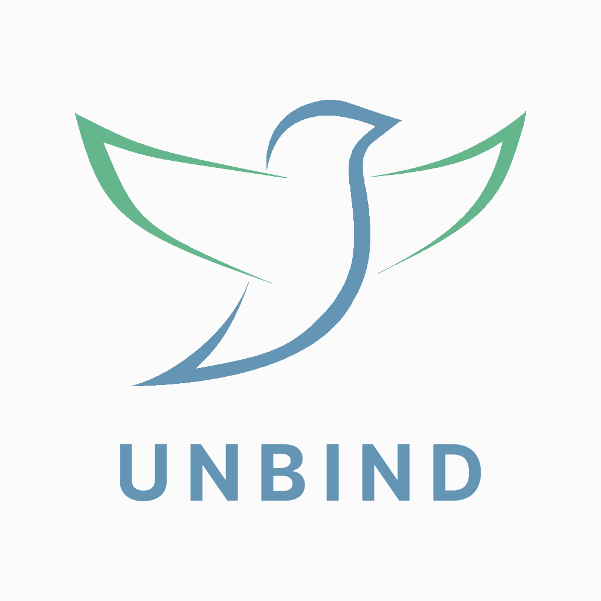

## Arquitetura e Desenho de Software 2019-1

### Sobre
UnBind tem como propósito ajudar as pessoas a terem uma melhor qualidade de vida.  

### Ambiente de Desenvolvimento
Para executar o ambiente de desenvolvimento, acesse o [guia](https://ads-unbind.github.io/unbind/extras/ambiente/).

### Colaboradores
Informações dos colaboradores:

| Nome | Matrícula | GitHub |
| --- | --- | --- |
| Byron Kamal | 15/0007281 | [byronkamal](https://github.com/byronkamal) |
| Eduardo Martins | 11/0115104 | [EduardoBrasil](https://github.com/EduardoBrasil) |
| Geovanne Santos | 15/0035756 | [saraivinha97](https://github.com/saraivinha97) |
| Igor Aragão | 15/0011903 | [roginaldosemog](https://github.com/roginaldosemog) |
| Igor Guimarães | 13/0028240 | [IgorVeludo](https://github.com/IgorVeludo) |
| João Pedro Mota | 16/0031982 | [jpmota2208](https://github.com/jpmota2208) |
| José Aquiles | 16/0010331 | [aquiles23](https://github.com/aquiles23) |
| Ramon Sales | 14/0160205 | [ramonsales](https://github.com/ramonsales) |
| Vinícius Cantuária | 14/0165169 | [cantuariavc](https://github.com/cantuariavc) |
| William Almeida | 16/0020280 | [WillAllmeida](https://github.com/WillAllmeida) |

### Contribuir
Para contribuir com a gente, o colaborador deve ler o [código de conduta](https://github.com/ads-unbind/unbind/blob/master/.github/CODE_OF_CONDUCT.md), dá um _fork_ e enviar um [pull request](https://github.com/ads-unbind/unbind/pulls) com sua contribuição.
O código será analisado por um dos proprietários do projeto e, se aprovado, incluído no núcleo da aplicação.
