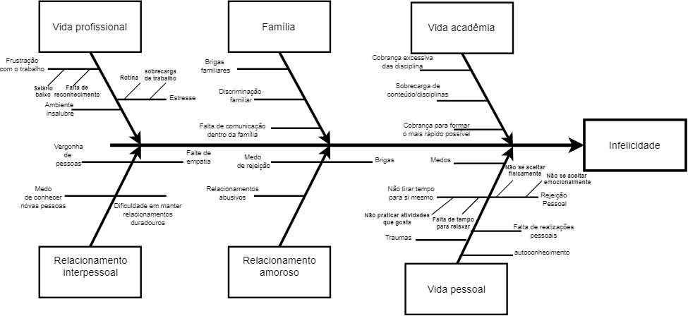

<h1>Elicitação de requisitos de usuário</h1>
<h3>Histórico de revisão</h3>

| Data       | Responsável      | Versão | Mudança realizada                      |
| ---------- | ---------------- | ------ | -------------------------------------- |
| 31/03/2019 | Byron Kamal e Igor Veludo  |  0.1   |  Topicos 1 até 3 e Primeira versão do Diagrama Causa-Efeito |

<h3>1. Introdução </h3>
O Diagrama de Ishikawa, também conhecido como Diagrama de Espinha de Peixe ou Diagrama de Causa e Efeito, é uma ferramenta da qualidade que ajuda a levantar as causas-raízes de um problema, analisando todos os fatores que envolvem a execução do processo.

<h3>2. Objetivo</h3>
 Este documento tem como objetivo mostrar algumas das principais causas para a infelicidade de uma pessoa utilizando o Diagrama de Causa-Efeito.

 <h3>3. Diagrama Cause-Efeito</h3>
 
 >autores: Byron Kamal

 <h3>Referências</h3>
 <ul>
 <li>O QUE É E COMO FAZER UM DIAGRAMA DE ISHIKAWA?
 Disponível em: <https://www.siteware.com.br/metodologias/diagrama-de-ishikawa>.
 Acesso em: 31/03/2019.
 </li>
 
 <li>Diagrama de Ishikawa. Disponível em: <https://blogdaqualidade.com.br/diagrama-de-ishikawa>. Acesso em: 31/03/2019.
 
 </li>
 </ul>