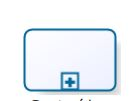
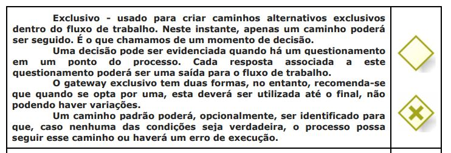
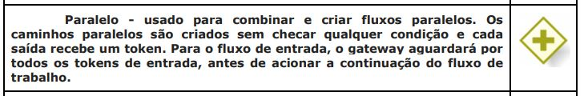

# Processos

### Histórico de Revisão

| Data       | Responsável      | Versão | Mudança realizada                      |
| ---------- | ---------------- | ------ | -------------------------------------- |
|04/04/2019|Byron Kamal e Ramon Sales| 0.1| Criação do documento de Metodologia do Projeto|

### 1.Introdução
Modelagem de processos utilizada neste documento foi BPMN (Business Process Model and Notation). Ela é uma notação para modelagem de processos de negócio. O BPMN estabelece um padrão para representar os processos graficamente, por meio de diagramas. sendo que esse padrão possui um conjunto de símbolos e regras.
A ferramenta utilizada para fazer a representar gráfica do modelo de processo foi o Bizagi Modeler

### 2.Objetivo
Este documento tem por objetivo apresentar os processos e subprocessos de gerência e desenvolvimento a serem utilizados na disciplina de Arquitetura e Desenho de Software no projeto JimCare.
### 3.Processo Geral

>Autores: Byron Kamal e Ramon Sales

**Legenda:**
#### Setas:

#### Tarefa:
Atividade que deve ser realizada.

#### Subprocesso:
Atividade que tem em seu interior a modelagem de outros atividades, eventos ou fluxos de sequência.

#### Evento:
é algo que “acontece” durante o curso do processo afetando o fluxo do processo.

#### Evento Final:
Indica o final de um processo.

#### Exclusivo:

#### Paralelo:

## 4.Referências

<ul>
<li>O que é BPMN (Business Process Model and Notation) e como aplicar essa notação na Modelagem de Processos.
Disponível em:
<https://www.euax.com.br/2017/02/o-que-e-bpmn-business-process-model-and-notation/>. Acessado em: 04/04/2019 </li>

<li>MANUAL DE MODELAGEM DE PROCESSOS COM BIZAGI MODELER.
Disponível em: <http://www.sgc.goias.gov.br/upload/arquivos/2017-04/manual-de-modelagem-de-processos-usando-bizagi.pdf>. Acessado em: 02/04/2019. </li>
</ul>
